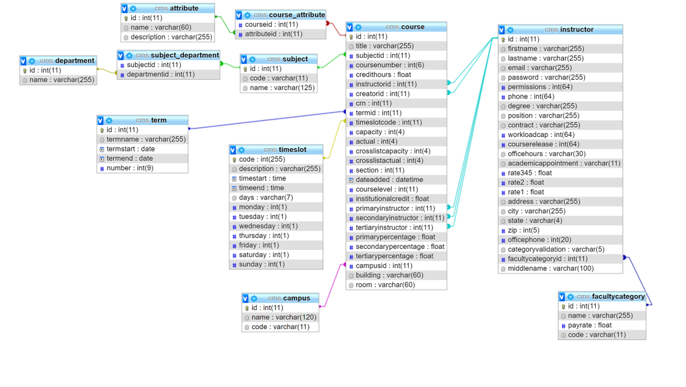
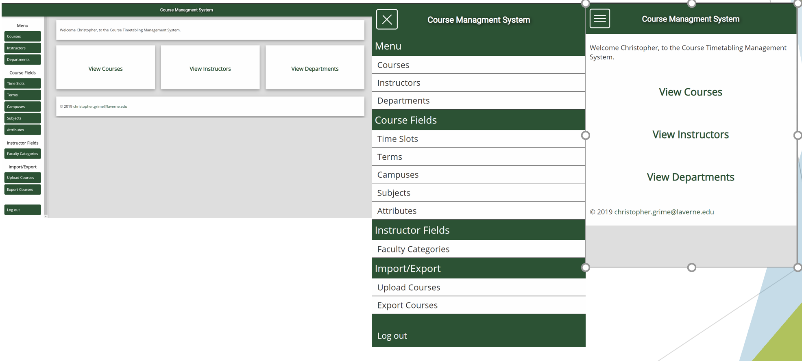
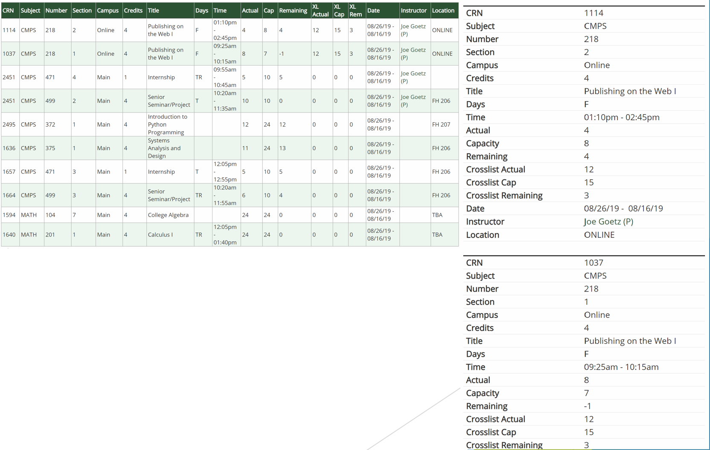
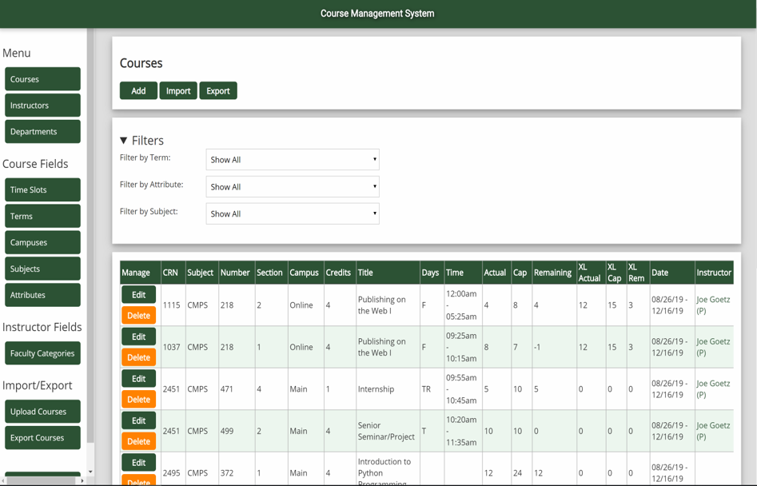
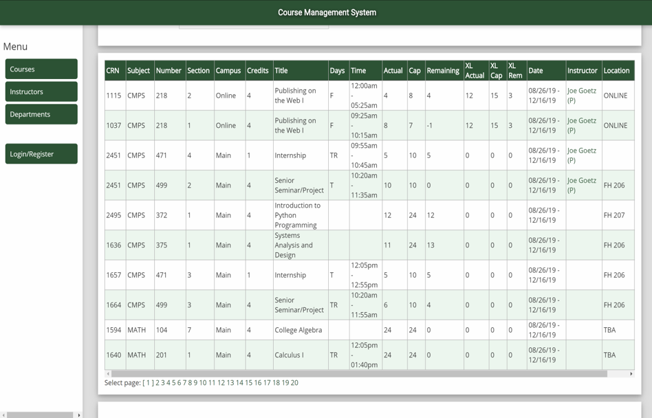
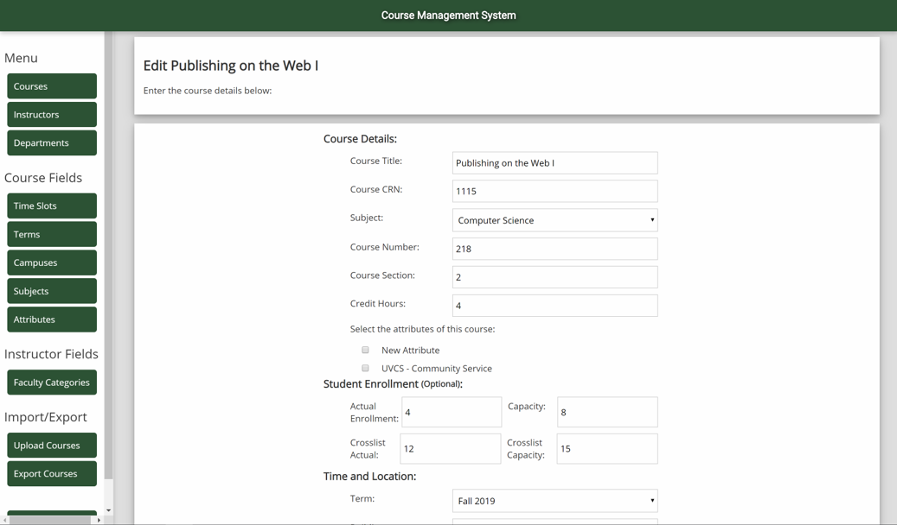
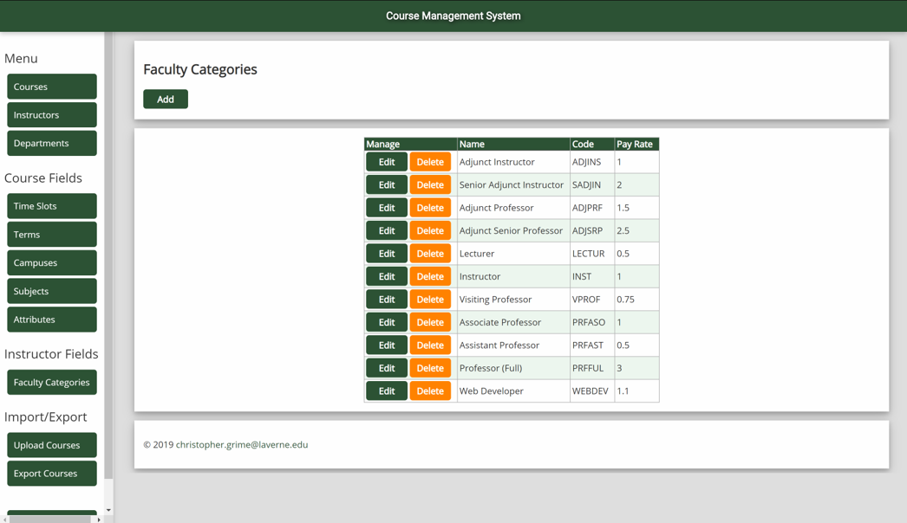

# Course and Faculty Management System

> Completed for my senior project as part of a requirement for a degree in Computer Science and Engineering at the University of La Verne during Fall 2019. Developed using HTML, CSS, PHP, and MySQL

> Course and Faculty Management System allows an organization to keep track of course offerings and schedules. Completed to fit the needs of the Natural Science Division

## Description

Course and Faculty Management System is a Web Application to allow educational organizations to efficiently organize and manage their courses and faculty. The web application is a password secured and database-driven website built with HTML, CSS, JavaScript, PHP, and MySQL. The design of the site is responsive, mobile-first guidelines. Public users can view the courses the university offers as well as which instructors teach them. Courses can be filtered by term and subject. Users that are logged in and have the correct permissions can edit/add/delete courses, departments, and instructors in the database. Site Admins can import files containing information about multiple courses as well as export the courses in the database to a CSV file. The site admin can also edit the other user’s permissions. Admins can easily view if there are conflicts in a faculty member's schedule. 

Developed using the framework found in *PHP & MySQL Novice to Ninja.* The textbook was used in the course *CMPS 320: Internet Apps Development.* In the course, I learned PHP functionality and how to create and modify PHP frameworks. Skills I learned were how to implement MVC pattern, routing, templating, handling HTTP requests, authentication, and access a SQL database. 

Throughout the completion of my senior project, I gained useful and practical knowledge about programming and application development. Mainly how important sticking to a consistent naming style is and keeping code organized. This was my first experience following the stages of development from gathering information and planning, to testing and launching the completed web application. I became a proficient PHP developer through the completion of this project.

## Features

- User authentication system with permissions
- CRUD operations 
- Responsive Design

## Screenshots

Database Design

Responsive Design Solutions

---

[grimechristopher.com](https://chrisgrime.com)  
[chris@chrisgrime.com](mailto:chris@chrisgrime.com)  
[linkedin/in/grimechristopher](https://linkedin/in/grimechristopher)  

